#Teachme app

Major assignment Term 2

View live: https://teachme-app.herokuapp.com/

# Problem Definition and Solution
## Problem

With today's highly competitive market, a convenient, feasible and efficient way of learning is needed.  

People seeking to upskill in remote areas or even in big cities need to commute to educational institutions,spending not only precious time but also monetary resources.

In many cases people can't afford education, or commuting is not an option, or perhaps they have a phisical limitation.  

From the Upskill side perspetive, many people are passionate about mentoring and sharing their skills, however they might encounter the some or all of the same problems listed above.   

Given all these, a solution that meet both needed is found with **Teachme**.

## Solution

Create an online only Tutor/student app where Upskill people can share their skills and get remunerated and students can learn about any skill they want to get or improve.

### Why Online?

* Costs
Costs are saved by not commuting.
* Time
By not commuting time can be utilized in learning more skills.
* Any Subject
People will be able to list any skill they want to share and search for any sill they are interested on.
* Comfort
Tutors and students can arrange their most suitable meeting time regardless of the place they are located.
* Self-paced
Students can arrange with tutors the number of lessons they wish at a desired pace.

### Detailed User Stories

***Any one is able to see a list of Subjects and browse within each subject***

**Feature** Browse app for Categories without login in

- When I type the app url I without login in 
- I want to see a list of Categories so I can search for 
- the category I am interested in

**Feature** Browse app within Categories without login in

- When clicking over a category I am interested in
- I want to see a list of all Lessons available in that category

***User should be able to edit their own profile***

**Feature:** Edit Profile

- As a User I want to edit my profile
- Because I want to keep my details up to date

**Scenario:** User edits profile

- As a logged User when I change any of my details
- I want to be able to see my changes after on the screen

***User should not be able to edit a profile that is not theirs***

**Feature:** Unable to edit other user's profile
- As a User I want nobody other than me to be able to edit my profile
- Because I want to have control over my profile details

**Scenario:** User attempts to edit another user's profile
- As a logged in user I wont be able to see an edit option to edit
- Someone elses profile either through a button on the screen or 
- through a url path

***User should be able to edit a Lesson listing that is theirs***

**Feature:** Edit Lesson Listing
- As a Tutor I want to edit my Lesson's listing
- in case I want to change the description or price.

**Scenario:** User edits Lesson listing
- As a tutor, when I loggedin I want to be able to edit only the lessons that are mine,
- And if I change any description 
- And I click "Update lesson"
- Then I should see the detailed view page for that lesson
- And the details should be updated

***User should not be able to edit a lesson that is not theirs***

**Feature:** Unable to edit other user's Lesson listing
- As a User and Tutor
- I want nobody other than me to be able to edit my lessons
- Because I want to have control over my listings

**Scenario:** User attempts to edit another user's lessons
- Given I'm a logged in User
- I won't be able to see an option to edit any other tutors
- lessons.

***User should be able to delete a lesson that is theirs***

**Feature:** Delete Lesson Listing
- As a Tutor
- I want to delete one of my lessons
- Because I do not want to carry on giving that lesson

**Scenario:** User deletes lesson
- Given I'm a logged in User
- When I go to the edit page for a lesson that is mine
- And I click 'delete lesson'
- Then the lesson should be deleted from the database and not
- available for booking.

***User should be able to give reviews to a Turtor***

**Feature:** Delete Lesson Listing
- Given I'm a logged in User
- When I go to a profile that is not mine
- and click on add review
- I want to be able to add a review and a rating

**Scenario:** User deletes lesson
- Given I'm a logged in User
- When I add a review and a rating
- then I should be able to see my review and
- rating printed under the profile

***User should not be able to open a message conversation with themselves***

**Feature:** Unable to message self
- As a User
- I do not want to see an option to message myself
- Because this would be pointless functionality

**Scenario:** User visits messages page
- Given I'm a logged in User
- When I go to the messages page
- Then my username is not listed as an option to message

---

***User should not see a 'message reader' button on their own profile***

**Feature:** No 'message reader' button on own profile
- As a User
- I do not want to see an option to message myself
- Because this would be pointless functionality

**Scenario:** User visits their profile page
- Given I'm a logged in User
- When I go to my profile page
- Then I do not see a 'message reader' button

---

***User should be able to view skill categories on homepage without logging in***

**Feature:** Homepage viewable without login
- As a User
- I want to view all skill categories without signing in
- Because I want to know if there are any categories I am
- Interested in

**Scenario:** User visits homepage
- Given I'm a logged out user
- When I go to the homepage
- Then I can view all the skill categories

***User should be able to view lessons available under all categories when clicking them without logging in***

**Feature:** Lessons per Category viewable without login
- As a User
- I want to view all lessons available per skill category without signing in
- Because I want to know if there are any lessons I am
- Interested in

**Scenario:** User clicks on one Category on the Homepage
- Given I'm a logged out user
- When I go to the homepage and click on any category
- I can view all the lessons listed under any category

***User should not be able to view any user Profile without logging in***

**Feature:** User must be logged in to see just the tutors profile
- As site Admin
- I want users to be required to log in in order to view a tutor profile
- To encourage users to signup and book lessons

**Scenario:** User dont have any access to profiles unless is logged in
- Given I'm a logged out user
- When I type a /profile url
- Then I am redirected to the login page

## Style Guide

Colours and fonts used:

### Colour Scheme

### Font

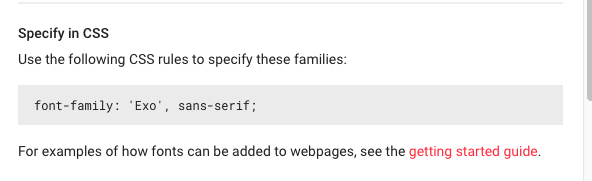

Decided to used soft colors in order to give more attention to
the skill Categories available.  Fonts give more style and make it easier
to go browse the text.

## Wireframes

# Mobile

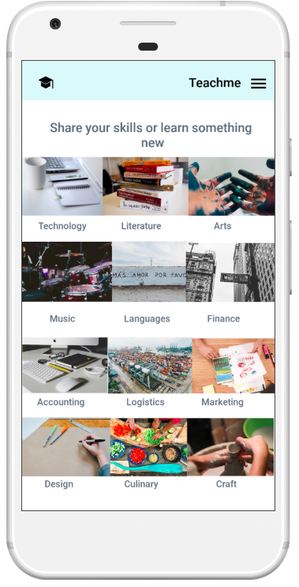
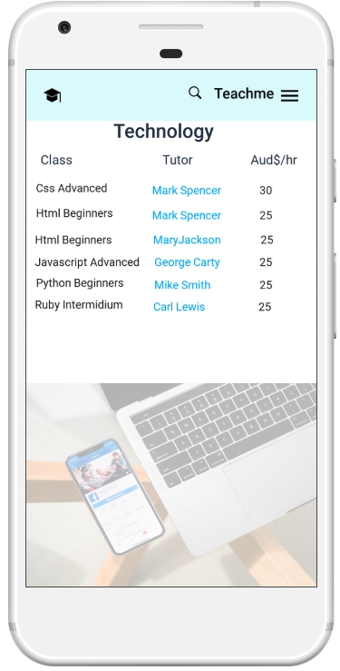

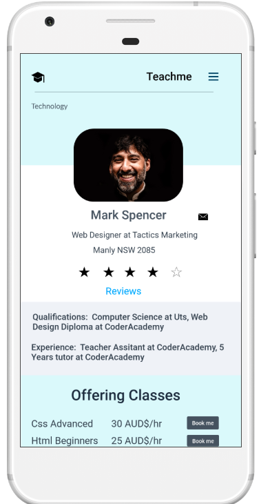
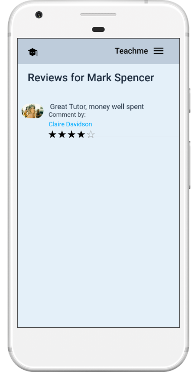
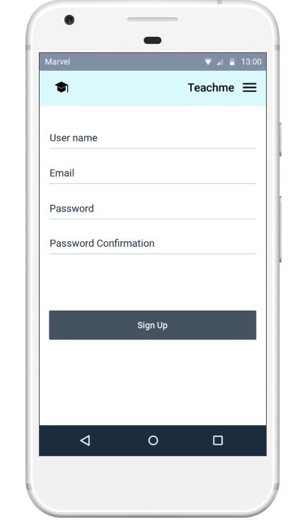

# Desktop

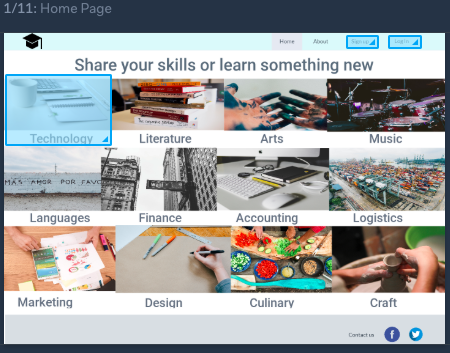
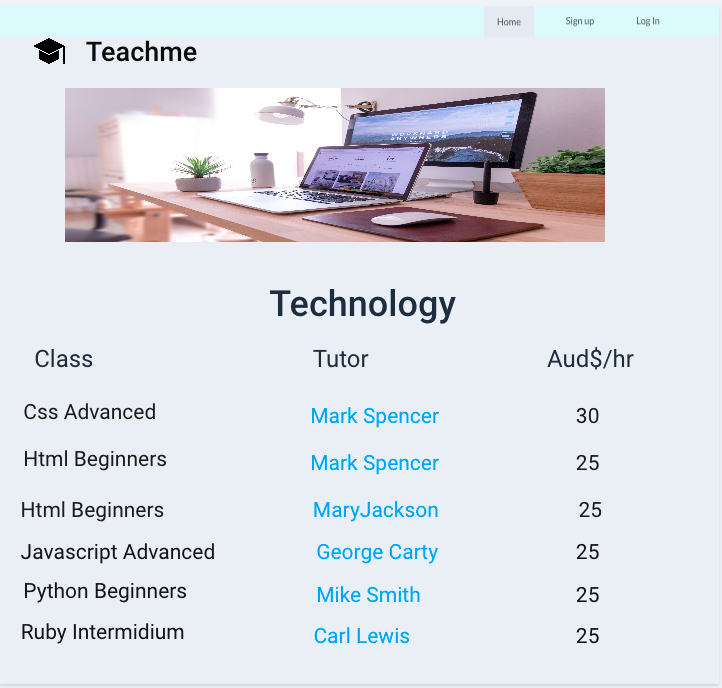
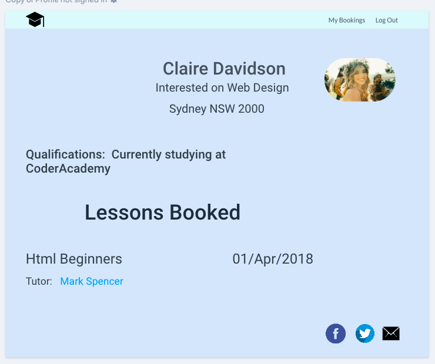
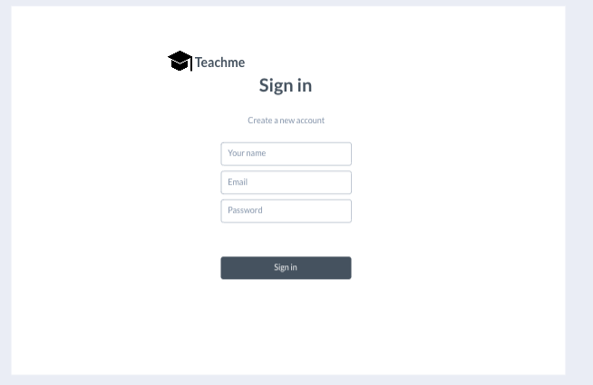
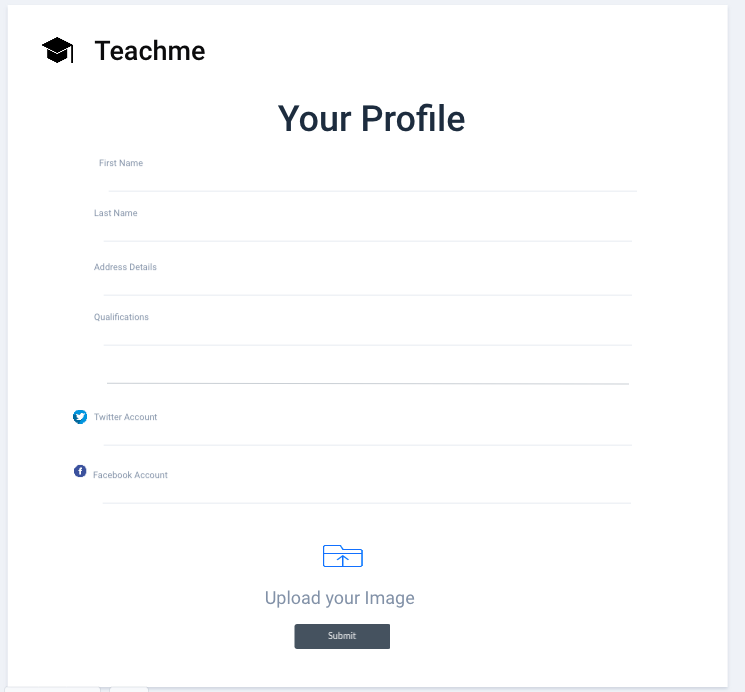

## Work Flow

### ERD

### Trello

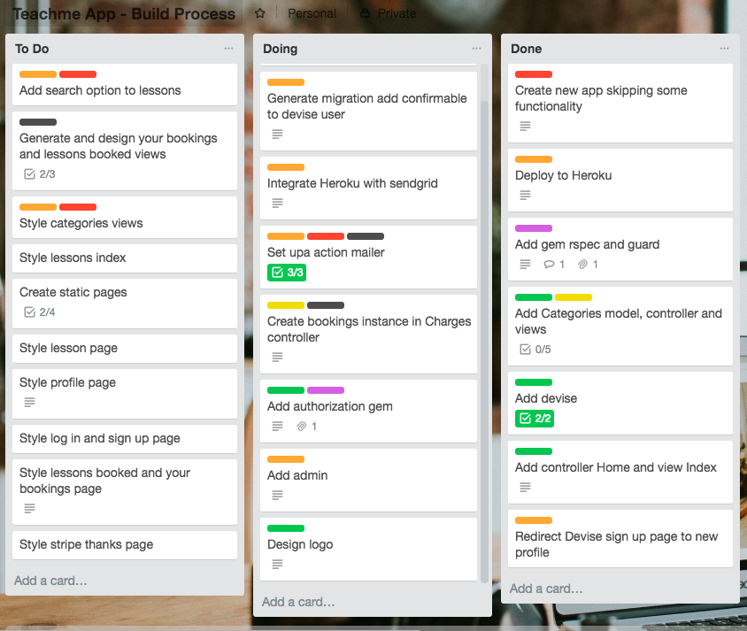
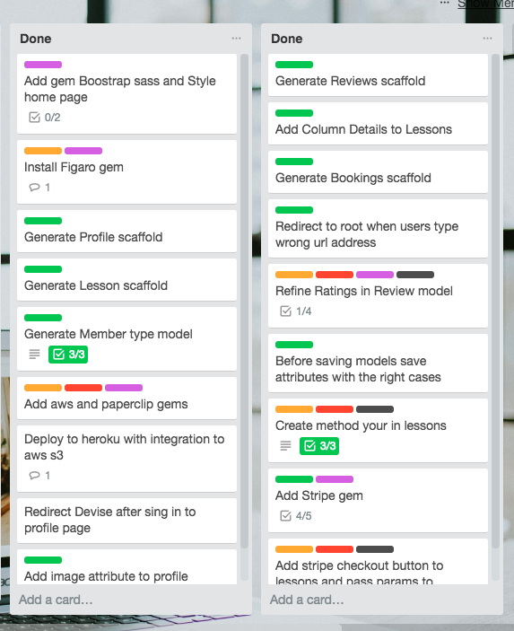

### MVP Features (with estimation time and status)

- User log in, sign up and sign out
1.5 hrs
Completed
- Profile (redirection when signed in)
1 hr
Completed
- Users profile - view and edit
3 hrs
Completed
- Reviews - view and add to profile
2 hrs
completed
- Lessons - create, view and edit
2.5 hrs
- Image uploading to Amazon S3 (avatar and listing images)
4.5 hrs
Completed
- Bookings - views and integration
3 hrs
Completed
- Search Categories (refinement and sort included)
1 hr
- Stripe payment integration
3 hrs
Completed
- Mailgrid and Action Mailer - Integration and Heroku
5 hrs
Completed
- Minimal CSS
5 hrs
Completed
- Uploaded on Heroku
1.5 hrs
Completed
- Admin interface
2 hrs
Incomplete
